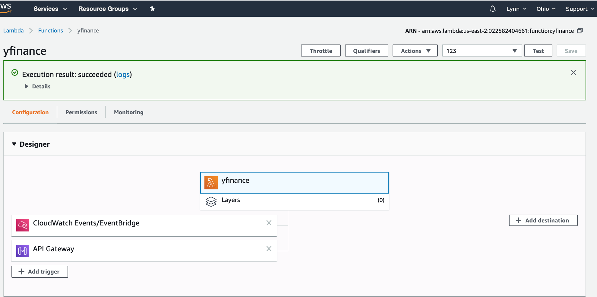
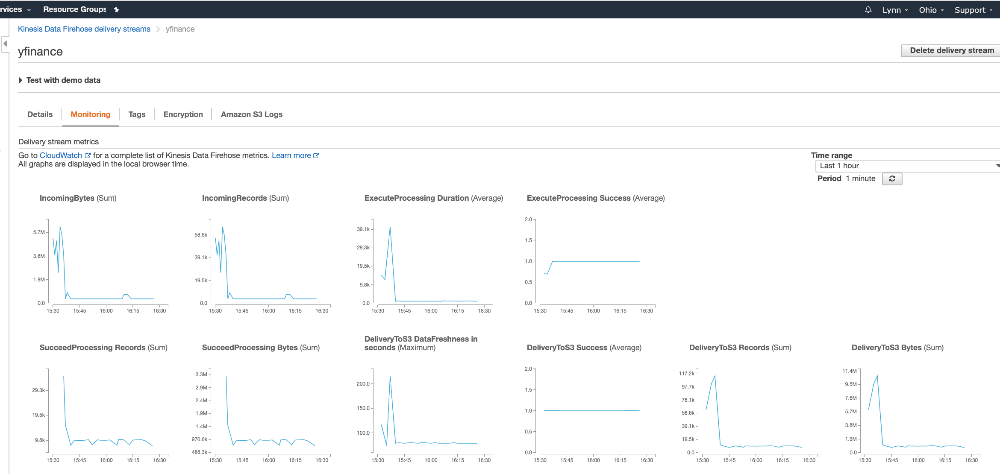

# STA9760_Streaming-Finance-Data-with-AWS-Lambda

# Lambda Configs

Lambda API trigger:https://v747vpzw7j.execute-api.us-east-2.amazonaws.com/default/yfinance

# Kinesis Monitor


# Data collector
https://github.com/besthl/STA9760_Streaming-Finance-Data-with-AWS-Lambda/blob/master/data_collector.py

# SQL Query
https://github.com/besthl/STA9760_Streaming-Finance-Data-with-AWS-Lambda/blob/master/query.sql

# Lambda Deployment Package

In order to run lambda functions that also manage dependencies, we must leverage a "deployment package", basically a zip file containing your lambda code _and_ all the dependencies it needs all packaged into a single artifact.

This repo provides a few tools that will help you manage your lambda functions and the dependencies.

## Developing

To develop your function:

Build your docker container - when you do this, your requirements.txt will be installed inside the container
```
docker build -t local_lambda .
```

As you make changes, run them like so:

```
docker run -v $(pwd):/app local_lambda python data_collector.py
```

NOTE: if you want to use a new dependency, you will have to rebuild the container

## Artifact

You want to create a zip file that you can upload to AWS. To do so, run the following:

```
docker build -t deployment -f Dockerfile.deployment_artifact .
```

This builds your zip file.

```
docker run -v $(pwd):/app/artifact deployment
```

This copies the file into your host filesystem so that you can upload it into Lambda.
